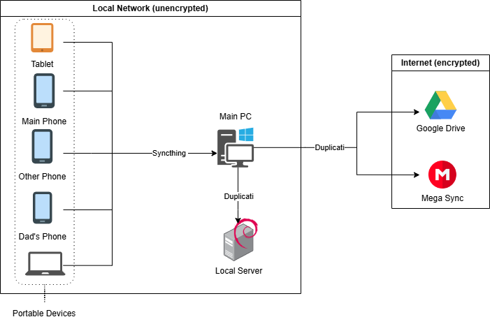
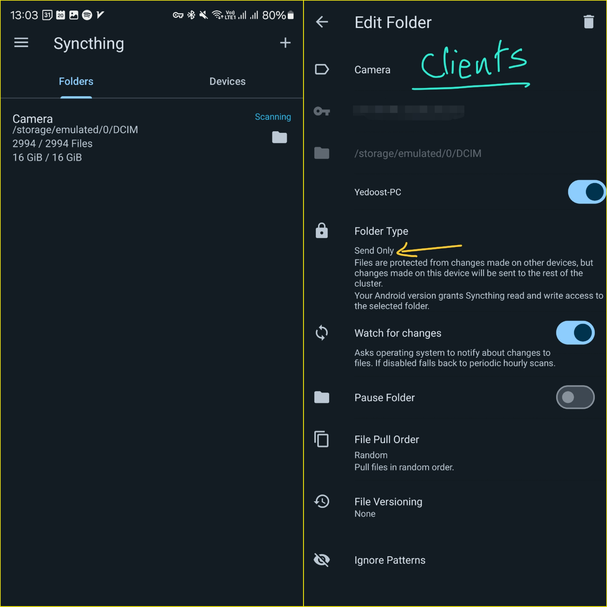
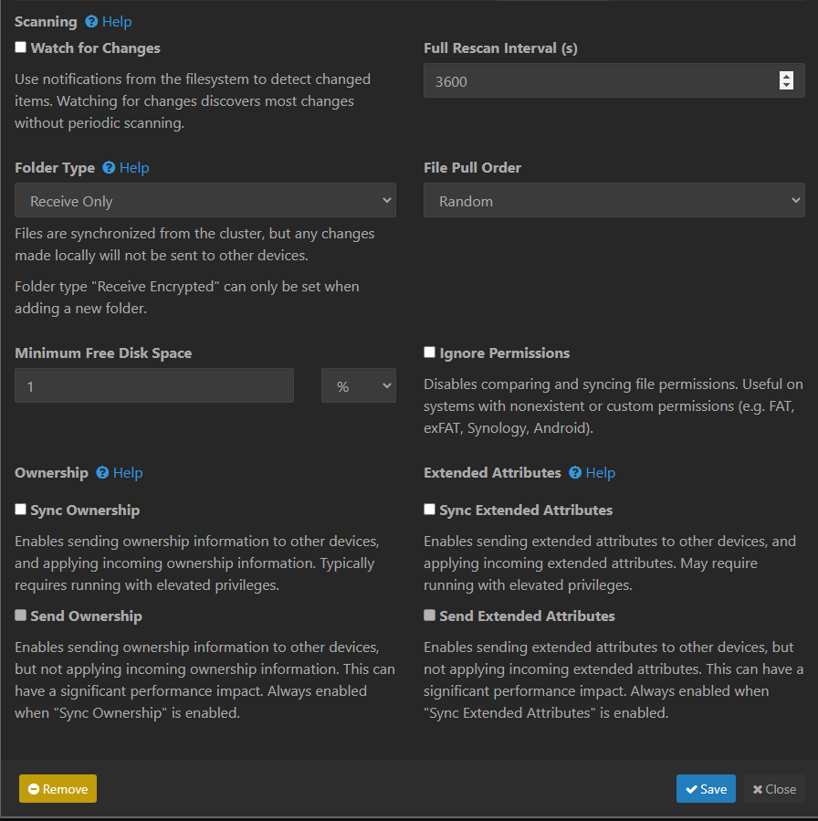
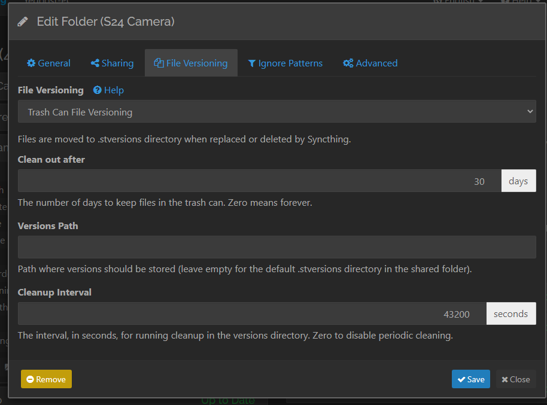

## مقدمه

در مورد اینکه چرا بکاپ گرفتن لازمه و چه مشکلاتی ممکنه پیش بیاد خودتون بهتر می‌دونید و قبلا مطلب زیاد نوشته شده (امیدوارم خودتون تجربه‌ی از دست دادن دیتا رو نداشته باشید)، واسه همین منم سرتون رو با مطالبی که تکراریه یا AI نوشته درد نمیارم و بعد از پیش‌زمینه‌ی کوتاه زیر، توی این پست به ابزار‌ها و flow بکاپی که راه انداختم می‌پردازم.

روش‌های مختلفی برای بکاپ گرفتن وجود داره، بکاپ روی کلاود (اینترنت)، بکاپ روی CD یا فلش، بکاپ متن روی کاغذ که باز هر کدوم اینا شامل بکاپ اتومات یا بکاپ دستی می‌شه. پستی در بلاگ [حامد](https://x.com/Hamed) من رو با **قانون بکاپ ۱ ۲ ۳** آشنا کرد که ایده‌ی اصلی سیستم بکاپی که راه انداختم از همین پست بود.

[قانون بکاپ ۱ ۲ ۳](https://www.seagate.com/gb/en/blog/what-is-a-3-2-1-backup-strategy/) به طور خلاصه می‌گه که:

1. شما باید **۳ تا کپی** از دیتا داشته باشید، یک نسخه‌ی اصلی و حداقل دو کپی
1. حداقل از **۲ فرمت مدیا** مختلف استفاده کنید، مثلا یکی CD، یکی دیجیتال، یکی کلاود یا یکی روی کاغذ!
1. حتما **۱ نسخه خارج** از محیطی که سایر نسخه‌ها (نسخه‌ی اصلی و کپی‌ها) توش هستند نگه‌دارید. مثلا یک نسخه‌ی بکاپ رو ببرید خونه‌ی فامیلی مادربزرگی چیزی

حالا با در ذهن داشتن این پیشفرض، بریم روش و ابزار‌های بکاپی که من استفاده می‌کنم رو معرفی کنیم.

## ابزار‌ها

برای بکاپ از ابزار‌های مختلفی استفاده می‌کنم که لیستش به طور خلاصه شامل اینا میشه که دوتای اولش رو توضیح میدم در ادامه:

- [duplicati](https://duplicati.com/): نرم‌افزاریه برای اتومات کردن روند بکاپ که کلی محیط مختلف (گوگل‌درایو، وان‌درایو، مگا، درایو ریموت و ...) رو ساپورت می‌کنه.
- [syncthing](https://syncthing.net): برای سینک کردن چنتا دیوایس مختلف با هم کاربرد داره و الزاما برای بکاپ نیست ([برای بکاپ توصیه نشده](https://docs.syncthing.net/users/faq.html#is-syncthing-my-ideal-backup-application))، ولی من برای رسیدن به قانون بکاپ ۱ ۲ ۳ ازش استفاده می‌کنم و ترکیبش کردم با بقیه ابزارا.
- Windows File History
- Windows Backup & Restore
- Windows Recovery

## روند‌کلی

روند‌های بکاپ من به دو تا حالت خودکار و دستی تقسیم می‌شه، بکاپ‌های خودکار رو با ابزار‌های بالا انجام می‌دم و بکاپ‌های دستی صرفا به بکاپ گرفتن از اطلاعاتم در بقیه‌ی پلتفرما مثل گوگل، تلگرام، ایمیل، توییتر و یا هر سایتی که دیتای مهمی دارم می‌تونم بکاپ بگیرم مربوط می‌شه.

### خودکار

روند خودکاری که برای بکاپ دارم به این صورته که ابتدا تمامی دستگاه‌های پرتابلی که دارم (موبایل‌ها، تبلت، لپ‌تاپ) با syncthing یک نسخه از پوشه‌های مهمشون (عکس‌ها، اسکرین‌شات‌ها، obsidian، zotero و ...) سینک می‌شه روی PC اصلی تو خونم، و بعدش از اونجا با duplicati پخش می‌شه جاهای مختلف که اصل ۱ ۲ ۳ رو داشته باشم. شما می‌تونید سرور، برد رزپری‌پای یا هر چیزی به هر تعدادی که می‌خواید داشته باشید اون وسط جای Main PC من، در ادامه این پست برای راحتی به این سیستم Main PC می‌گم سرور اصلی.

#### Syncthing

ابتدا نیازه که syncthing رو روی سرور اصلی و تمامی دیوایس‌های پرتابل نصب کنید. فرایند نصبش کار خاصی نداره. بعدش با هدف بکاپ، هر پوشه‌ای که بخواید رو می‌تونید در سمت کلاینت (دیوایس‌های پرتابلتون) به صورت زیر تنظیم کنید:  

  

دقت کنید که هر پوشه‌ای که بخواید رو می‌تونید تنظیم کنید، فقط حالت فولدر رو بر روی `Send Only` تنظیم کنید.
و در سمت سرور هم تنظیمات به صورت زیر هست:  

  

که مهم ترین نکتش اینه که سمت سرور اصلی فولدر تایپ رو روی `Recieve Only` تنظیم کنید
برای ورژنینگ با هدف اینکه ما اینجا از syncthing به عنوان ابزار بکاپ موقت استفاده می‌کنیم، چیزی که من انتخاب کردم trash can بود و به صورت زیر تنظیمش کردم:  

  

در این حالت، اگر فایلی سمت موبایلم توسط خودم پاک بشه، به مدت ۳۰ روز یک نسخه ازش روی سیستم اصلیم در پوشه‌ی syncthing باقی می‌مونه و بعد از ۳۰ روز پاک سازی میشه (دقت کنید هنوز ممکنه یک یا چند نسخه ازش در duplicati که در جلوتر تنظیم می‌کنیم بر اساس تنظیماتتون باشه.)

#### duplicati

WIP
