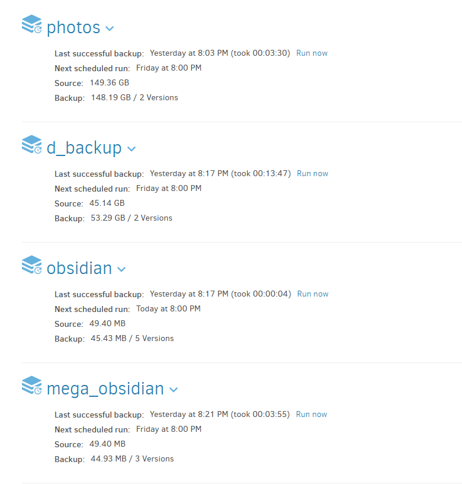
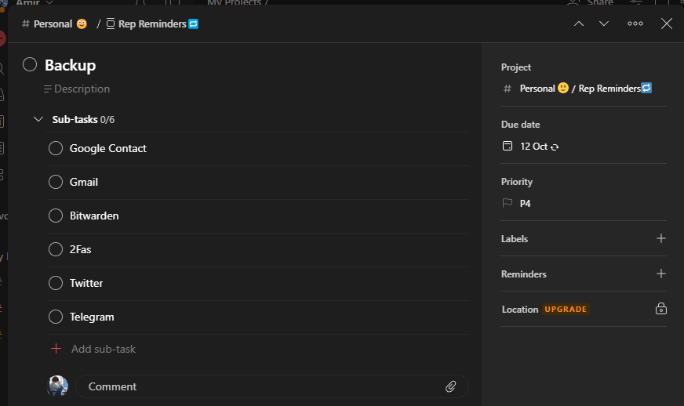
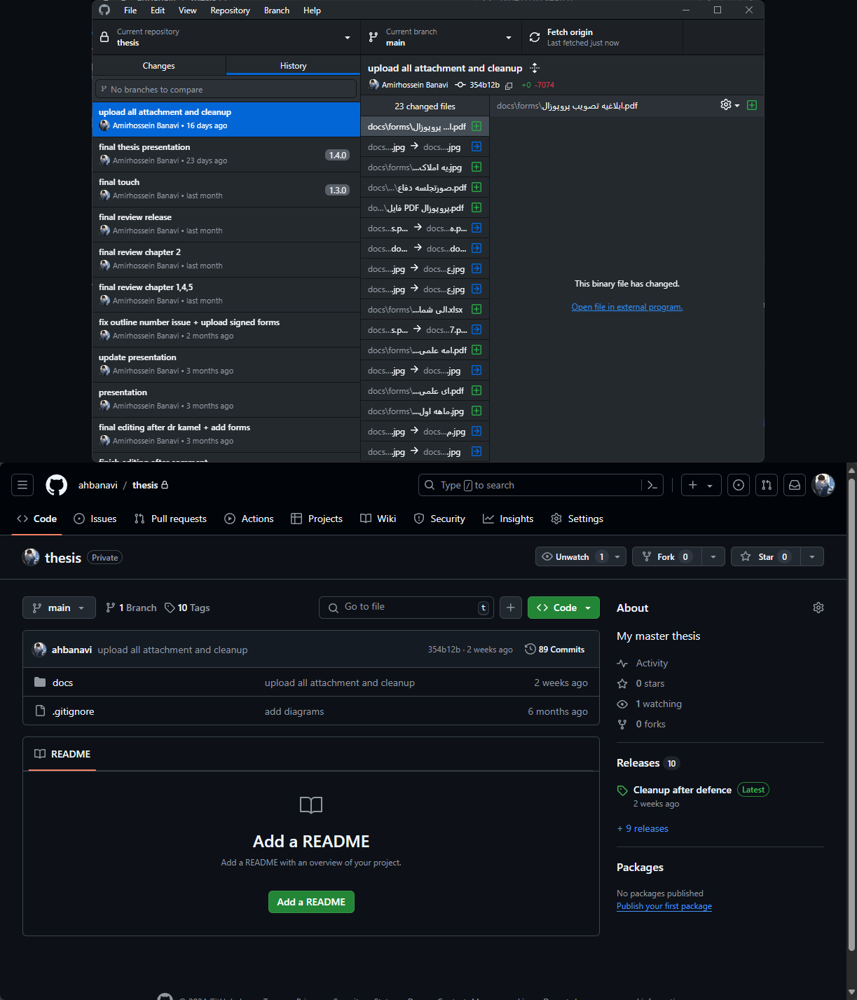

## مقدمه

در مورد اینکه چرا بکاپ گرفتن لازمه و چه مشکلاتی ممکنه پیش بیاد خودتون بهتر می‌دونید و قبلاً مطلب زیاد نوشته شده (امیدوارم تجربه‌ی از دست‌دادن دیتا رو نداشته باشید)، واسه همین منم سرتون رو با مطالبی که تکراریه یا AI نوشته درد نمیارم و بعد از پیش‌زمینه‌ی کوتاه زیر، توی این پست به ابزارها و flow بکاپی که راه انداختم می‌پردازم.  
روش‌های مختلفی برای بکاپ گرفتن وجود داره، بکاپ روی کلاود و اینترنت، بکاپ روی CD یا فلش، بکاپ متن روی کاغذ که باز هر کدوم اینا شامل بکاپ اتومات یا بکاپ دستی می‌شه. پستی در بلاگ [حامد](https://x.com/Hamed) من رو با **قانون بکاپ ۱ ۲ ۳** آشنا کرد که ایده‌ی اصلی روند بکاپی که راه انداختم از همین پست بود.
[قانون بکاپ ۱ ۲ ۳](https://www.seagate.com/gb/en/blog/what-is-a-3-2-1-backup-strategy/) به طور خلاصه می‌گه که:

1. شما باید **۳ تا کپی** از دیتا داشته باشید، یک نسخه‌ی اصلی و حداقل دو کپی
1. حداقل از **۲ فرمت مدیا** مختلف استفاده کنید، مثلا یکی CD، یکی دیجیتال، یکی کلاود یا یکی روی کاغذ!
1. حتما **۱ نسخه خارج** از محیطی که سایر نسخه‌ها (نسخه‌ی اصلی و کپی‌ها) توش هستند نگه‌دارید. مثلا یک نسخه‌ی بکاپ رو ببرید خونه‌ی فامیلی مادربزرگی چیزی

حالا با در ذهن داشتن این پیش‌فرض، بریم روش و ابزار‌های بکاپی که استفاده می‌کنم رو معرفی کنیم.

## ابزار‌ها

برای بکاپ از ابزار‌های مختلفی استفاده می‌کنم که لیستش به طور خلاصه شامل اینا می‌شه که دوتای اولش رو توضیح میدم در ادامه، بقیش رو خوتون سرچ کنید مطلب زیاده :)

- [duplicati](https://duplicati.com/): نرم‌افزاریه برای اتومات کردن روند بکاپ که کلی محیط مختلف (گوگل‌درایو، وان‌درایو، مگا، درایو ریموت و ...) رو ساپورت می‌کنه.
- [syncthing](https://syncthing.net): برای سینک کردن چنتا دیوایس مختلف با هم کاربرد داره و الزاما برای بکاپ نیست ([برای بکاپ توصیه نشده](https://docs.syncthing.net/users/faq.html#is-syncthing-my-ideal-backup-application))، ولی من برای رسیدن به قانون بکاپ ۱ ۲ ۳ ازش استفاده می‌کنم و ترکیبش کردم با بقیه ابزارا.
- Windows File History
- Windows Backup & Restore
- Windows Recovery

> [!info] نکته مهم:
> اگر دارین توی محیط‌های ابری بکاپ می‌گیرین، حتما بکاپتون **انکریپت شده** باشه! ابزاری که اینجا معرفی کردم یعنی duplicati این کارو برامون انجام می‌ده.

## روند‌کلی

روند‌های بکاپ من به دو تا حالت خودکار و دستی تقسیم می‌شه، بکاپ‌های خودکار رو با ابزار‌های بالا انجام می‌دم و بکاپ‌های دستی صرفا به بکاپ گرفتن از اطلاعاتم در بقیه‌ی پلتفرما مثل گوگل، تلگرام، ایمیل، توییتر و یا هر سایتی که دیتای مهمی دارم و می‌تونم بکاپ بگیرم مربوط می‌شه.

### خودکار

روند خودکاری که برای بکاپ دارم به این صورته که ابتدا تمامی دستگاه‌های پرتابلی که دارم (موبایل‌ها، تبلت، لپ‌تاپ) با syncthing یک نسخه از پوشه‌های مهمشون (عکس‌ها، اسکرین‌شات‌ها، obsidian، zotero و ...) سینک می‌شه روی PC اصلی تو خونم، و بعدش از اونجا با duplicati پخش می‌شه جاهای مختلف که اصل ۱ ۲ ۳ رو داشته باشم. شما می‌تونید سرور، برد رزپری‌پای یا هر چیزی به هر تعدادی که می‌خواید داشته باشید اون وسط جای Main PC من.


#### ابزار Syncthing

ابتدا نیازه که Syncthing رو روی سرور اصلی (Main PC) و تمامی دیوایس‌های پرتابل نصب کنید (بر خلاف داپلیکاتی که فقط نیازه سمت کلاینت نصب بشه، Syncthing باید روی تمامی دیوایس‌های سرور و کلاینت نصب شده باشه). فرایند نصبش کار خاصی نداره. بعدش با هدف بکاپ، هر پوشه‌ای که بخواید رو می‌تونید در سمت کلاینت (دیوایس‌های پرتابلتون) به صورت زیر تنظیم کنید:


دقت کنید که هر پوشه‌ای که بخواید رو می‌تونید تنظیم کنید، فقط حالت فولدر رو بر روی `Send Only` تنظیم کنید.
و در سمت سرور هم تنظیمات به صورت زیر هست:


که مهم ترین نکتش اینه که سمت سرور اصلی فولدر تایپ رو روی `Recieve Only` تنظیم کنید.
برای ورژنینگ با هدف اینکه ما اینجا از syncthing به عنوان ابزار بکاپ موقت استفاده می‌کنیم، چیزی که من انتخاب کردم trash can بود و به صورت زیر تنظیمش کردم:


در این حالت، اگر فایلی سمت موبایلم پاک بشه، به مدت ۳۰ روز یک نسخه ازش روی سیستم اصلیم در پوشه‌ی syncthing باقی می‌مونه و بعد از ۳۰ روز پاک سازی میشه (دقت کنید ممکنه یک یا چند نسخه ازش در duplicati که در جلوتر تنظیم می‌کنیم بر اساس تنظیماتتون باشه.)

#### ابزار duplicati

داپلیکاتی هموطور که گفتم ابزاریه که باهاش می‌تونین روند بکاپ به سایر مقصد‌هارو از سمت کلاینت اتومات کنید و فقط نیازه که سمت کلاینت مبداتون که تو روند من صرفا Main PC هست نصب بشه. تنظیماتش واضح و سادست. من ازش برای فرستادن بکاپم به یک سرور داخلی، گوگل درایو و مگا استفاده می‌کنم. از اونجایی که گوگل درایو و مگام رایگان هستن و به ترتیب ۱۵ و ۲۰ گیگ حجم بیشتر ندارن، از این دو تا مقصد صرفا برای بکاپ گرفتن داکیومنت‌ها و اسناد مهمم که حجم زیادی هم ندارن استفاده می‌کنم. سرور داخلی رو از طریق [samba](https://www.samba.org/) مونتش کردم روی یکی از درایو‌های ویندوزم و در داپلیکاتی مسیر اونجا رو دادم، هر چند که داپلیکاتی ساپورت sftp و ftp هم داره. لیست کامل مقصد‌های ساپورت شده‌ی داپلیکاتی رو [اینجا](https://docs.duplicati.com/en/latest/05-storage-providers/) می‌تونید پیدا کنید.

یک مزیت مهم دیگه‌ی داپلیکاتی این هست که می‌تونید دیتای بکاپتون رو **انکریپت** کنید که من شدیدا توصیه می‌کنم اگر مقصد بکاپ سرویس کلاود مثل گوگل درایو یا مگا هست حتما حتما انکریپت کنید و کلیدش رو یک جای امن نگه‌داری کنید (در مورد نگه‌داری کلید‌ها در آینده یک پست می‌نویسم). همچنین داپلیکاتی اطلاعات بکاپ گرفته شده رو فشرده‌سازی هم می‌کنه و در صورت اضافه شدن فایل جدید به بکاپ یا تغییراتش، مجددا کل دیتا رو برای بکاپ ارسال نمی‌کنه و صرفا تغییرات رو سمت بکاپ اعمال می‌کنه که این با توجه به شرایط اینترنت ما مزیت خوبیه.

تنظیمات داپلیکاتی من عمدتا به این صورت هست: یک سری مسیر‌های مبدا پرحجم مثل پوشه‌ی عکسام که ۱۵۰ گیگ هست رو به صورت هفتگی بکاپ می‌گیرم. سایر فایل‌ها مثل پوشه‌ی obsidian و داکیومنت‌هام رو به صورت روزانه یا روز در میون. مدیریت بکاپ از نظر پاک‌سازی و نگهداری نسخه‌ها (Backup retention) رو هم اگر محدودیت خاصی سمت سرور بکاپ نداشته باشم روی smart تنظیم می‌کنم. طبق توضیحات خود داپلیکاتی این حالت به صورت زیر عمل می‌کنه که بنظرم دیفالت خوبیه.

> Over time backups will be deleted automatically. There will remain one backup for each of the last 7 days, each of the last 4 weeks, each of the last 12 months. There will always be at least one remaining backup.



### دستی

هیچ تضمینی نیست که اطلاعات شما در سایر سرویس‌ها مثل گوگل، توییتر، ایمیل، تلگرام و ... همیشه نگه‌داری بشه یا شما دسترسی بهش رو داشته باشین. بهتره که در بازه‌های ۳ ماهه، ۶ ماهه و یا حتی یک ساله از اطلاعات مهمتون در سایر سرویس‌ها اکسپورت و بکاپ بگیرید. جاهایی که ازشون خروجی و بکاپ می‌گیرم ایناست و توی همشون گزینه‌ی export گرفتن از اطلاعاتتون وجود داره و با یک سرچ می‌تونید روندش رو پیدا کنید:

- Google Contact
- Gmail
- [Bitwarden](https://bitwarden.com/): حتما حتما انریکپت شده بکاپ بگیرید.
- [2Fas](https://2fas.com/): این هم حتما حتما انکریپت شده باشه.
- Twitter
- و یک سری چت‌های مهم Telegram

اگر سرویس‌ دیگه‌ای استفاده می‌کنید که مهم هست براتون سرچ کنید. احتمالا ابزار رسمی یا غیر رسمی برای خروجی گرفتن از اطلاعاتتون براش باشه.
برای یادآوری هم من یک تسک توی [Todoist](https://todoist.com/) تعریف کردم که هر سه ماه تکرار می‌شه و میاد توی inbox ام که یادآوری کنه بهم:


## تکمیلی

اینجا چنتا مطلب خارج از فلوی بالا رو اضافه می‌کنم که بهم در راستای رسیدن به اصلی ۱ ۲ ۳ بکاپ کمک می‌کنن.

#### بکاپ WSL

قبلا یکی دو بار سر چنتا سوتی کل اطلاعات WSL ام که عملا استک اصلی کاریم توش هست رو از دست دادم. برای همین از WSL ام هم به طور منظم بکاپ می‌گیرم. برای این‌کار اسکریپت زیر رو در Task Scheduler ویندوز تنظیم کردم که هفتگی اجرا بشه که این فایل arch.tar توسط duplicati بعدا یک نسخه‌ی دیگه هم ازش بکاپ گرفته می‌شه:

```powershell
wsl --export Arch 'D:\Backups\wsl\arch.tar'
```

#### بکاپ عکس‌ها در Google Photos

پلن رایگان ۱۵ گیگ گوگل فوتوز در حالت `storage server` واقعا برای چند سال جواب هست، حداقل برای من تا الان حدود ۷.۵ گیگ ازش پر شده. این رو هم می‌تونید استفاده کنید. مزیت بزرگ گوگل فوتوز در کنار بکاپ، سیستم سرچ بر اساس متنشه که فارسی هم پشتیبانی می‌کنه. بارها شده که دنبال یک عکس خاص از میون چند هزار عکسی که دارم می‌گشتم که با یک سرچ توی گوگل فوتوز سریع پیداش کردم.

#### گیت و گیتهاب

گیت و گیتهاب صرفا برای کار نیستند! هر چند که عملا ابزار بکاپ محسوب نمی‌شن، ولی تکمیل کننده‌ی روند بکاپم هستند. اگر دارین طولانی مدت روی یک فایل متنی یا هر چیزی کار می‌کنید که حجم زیادی هم نداره، می‌تونید از گیت و گیتهاب (یا هر گیت سروری حتی لوکال) برای بکاپ داشتن از اون استفاده کنید. من پایان‌نامم رو که حدود یک سال هم درگیرش بودم رو توی گیتهاب مدیریت کردم. برای اینکه درگیر کامند‌لاین هم نشید می‌تونید GitHub Desktop رو نصب کنید و خیلی راحت مدیریت کنید. مزیتی که داره اینه که هیستوری تمام تغییرات رو دارید و همینطور می‌تونید از خاصیت برنچ و تگ گیتهاب هم بر حسب نیازتون استفاده کنید.


علاوه‌بر اینا، فایل‌های تنظیمات لینوکسم رو (dotfiles) از طریق روشی که در [این مقاله](https://www.atlassian.com/git/tutorials/dotfiles) توضیح داده روی گیت و [مخزن گیتهاب](https://github.com/ahbanavi/dotfiles) مدیریت می‌کنم و اینجوری در دیوایس‌های مختلفمم سینک هستم.

## پایان

در این مطلب که اولین پست بلاگمم بود، در مورد روش بکاپم که قبلا در موردش توییت هم زیاد زده بودم ([۱](https://x.com/iyedoost/status/1827762078309929013) [۲](https://x.com/iyedoost/status/1827791126750736854) [۳](https://x.com/iyedoost/status/1796964495299870736) [۴](https://x.com/iyedoost/status/1745099192794521915) [۵](https://x.com/iyedoost/status/1809167269806670247)) صحبت کردم. به طور خلاصه از اطلاعات مهممون باید همیشه چنتا کپی داشته باشیم. چرا؟ چون زندگی پر از اتفاقات غیر منتظره‌است!
اگر سوال، مطلب تکمیلی و یا موردی هست که از قلم انداختم خوشحال می‌شم باهاتون در بخش نظرات در تعامل باشم. اگرم دوست داشتید می‌تونید ابزار‌هایی که شما استفاده می‌کنید رو در زیر بنویسید که من و بقیه‌هم استفاده کنید.

**به امید اینکه هیچ‌وقت مجبور نشیم از بکاپ‌هامون استفاده کنیم!**
(اما اگر روزی بهش نیاز پیدا کردیم، حداقل خیالمون راحت باشه که اطلاعاتمون امنه.)

پست بعدی می‌بینمتون ;)
