Hi, in this post I'm diving into how I set up [n8n](https://n8n.io/), a powerful AI-native workflow automation tool, on my local Orange Pi. The main challenge I faced was that I needed to set up reliable webhook endpoints (especially for Telegram Bot API) on my home server without having DDNS or a static IP address from my ISP (my ISP does provide static IPs, but I didn't want to pay extra for it. Plus, exposing my home server directly to the internet isn't as secure as using a zero trust approach.).
So, to solve this problem, I secured my setup with [Cloudflare Zero Trust (CFZT)](https://www.cloudflare.com/zero-trust/), which allows me to access my n8n instance from anywhere in the world via the internet and provides stable webhook endpoints that external services can reliably connect to. At the end, I'll also show you how to create a sample AI-enabled Grammarly Telegram bot with n8n that automatically corrects and improves your text.

**What You'll Need**

* **Local Device**: You'll need a device that's always on, like a Raspberry Pi, Orange Pi, or even an old PC/laptop running any OS that supports Docker. I'm using an [Orange Pi 5 Pro](http://www.orangepi.org/html/hardWare/computerAndMicrocontrollers/details/Orange-Pi-5-Pro.html) with [Armbian](https://www.armbian.com/) and [OpenMediaVault (OMV)](https://www.openmediavault.org/) installed.
* **Cloudflare Account**: The free tier is sufficient for this setup.
* **Domain Name**: If you want to use n8n with webhook (e.g. Telegram Bots), you'll need one Domain registered with Cloudflare to use it in Zero Trust.

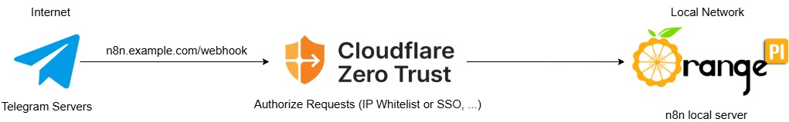

## Step 1: Installing n8n

To cut things short, I'll skip installing Docker. If you don't have Docker installed, follow the [docker installation documents](https://docs.docker.com/desktop/). If you have any questions about that, ask in the comments.

To install n8n using Docker, use this Docker Compose file, and set up environment variables as needed:

```yml
# https://gist.github.com/ahbanavi/308b27b5538559352dac960d48772cde

services:
  n8n:
    image: docker.n8n.io/n8nio/n8n
    container_name: n8n
    restart: always
    environments:
      N8N_SECURE_COOKIE=false # If you also want to use it with localhost
      WEBHOOK_URL=https://n8n.example.com # The domain configured in Cloudflare Zero Trust
    ports:
      - "5678:5678"
    volumes:
      - n8n_data:/home/node/.n8n

volumes:
  n8n_data:
    external: false
```

If you're lazy, like me, just run this command to download the compose file to your device:  

```bash
curl -o docker-compose.yml https://gist.githubusercontent.com/ahbanavi/308b27b5538559352dac960d48772cde/raw/n8n-docker-compose.yml
````

And then a simple `docker compose up -d` is enough to run n8n. You'll probably need to get back to this and change the `WEBHOOK_URL` to the one you'll later set up in CFZT. If so, remember to do a `docker compose down && docker compose up -d` after changing the `yml` file.

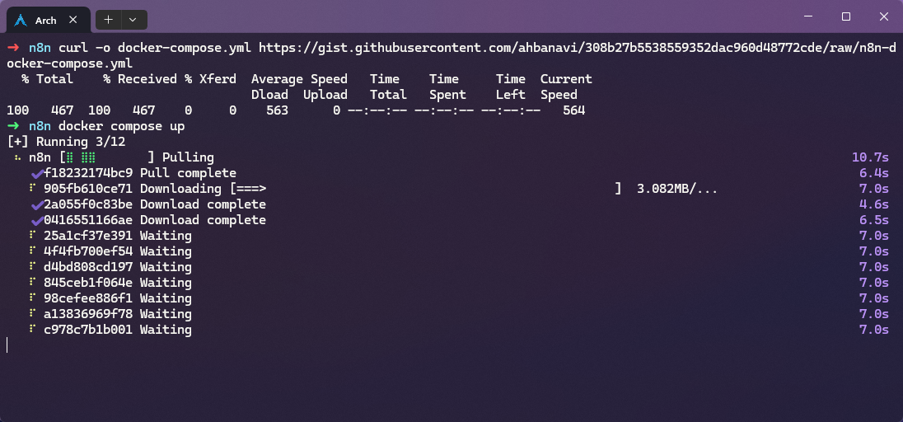

Then, you can access it via the `5678` port of your local server. Just follow the setup steps, and you'll be good to go.

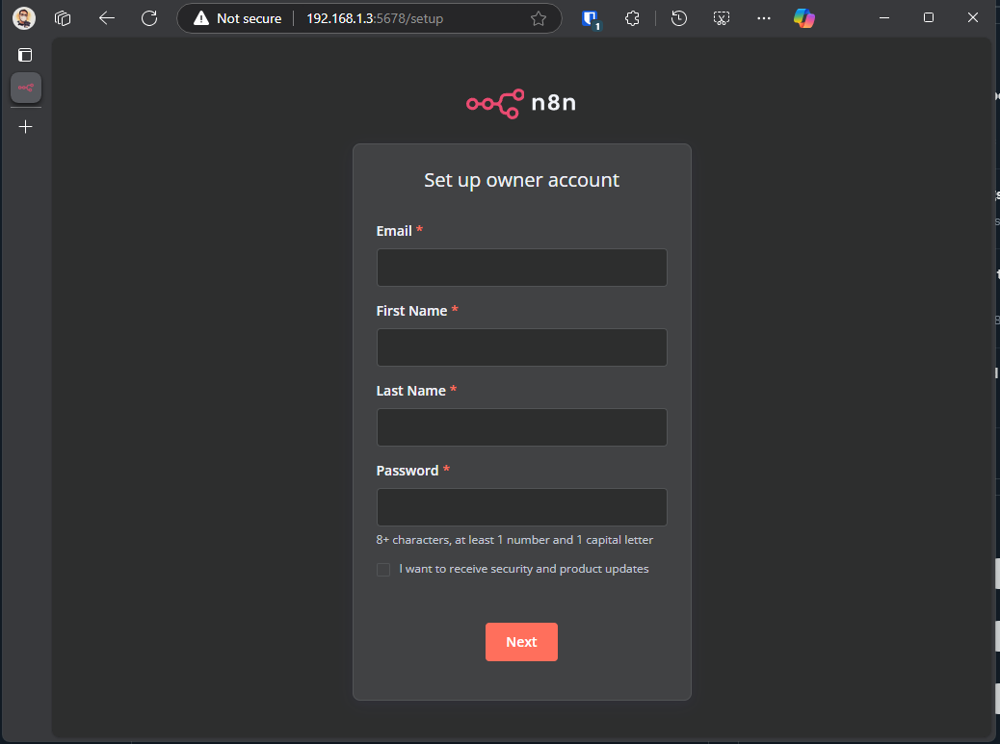
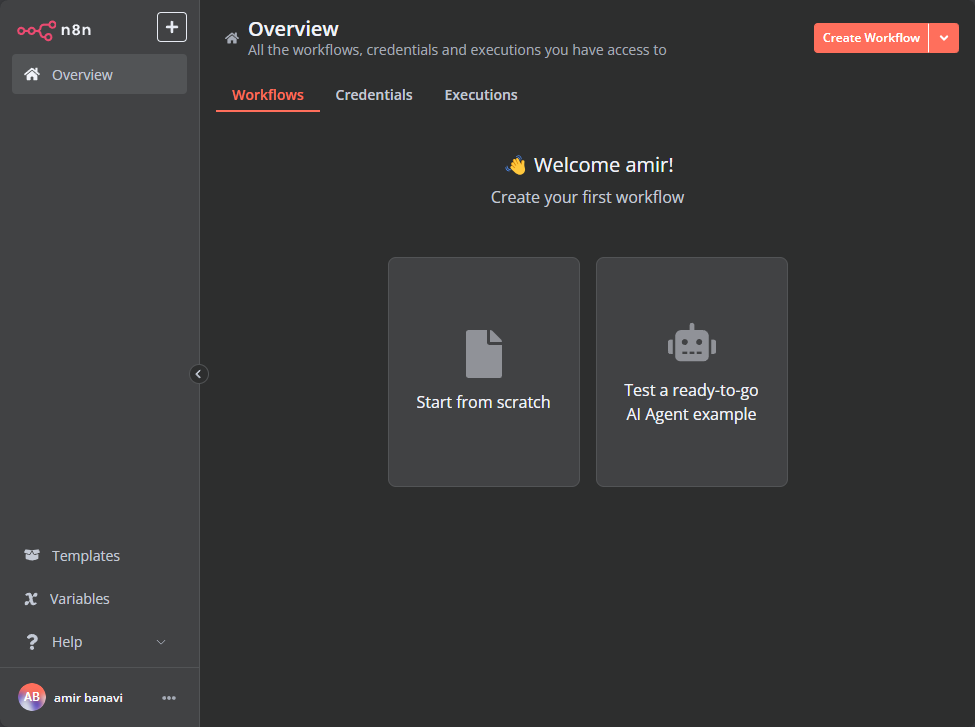

After we are done setting up a webhook address via CFZT, I'll run a simple Telegram bot to showcase that the webhook URL is working. But for now, let's jump to the part where you can connect a public webhook to the domain you configured in n8n, with CFZT.

## Step 2. Cloudflare Zero Trust

First things first, you'll need at least one domain configured in your Cloudflare account. The process is simple; you can do it in the [dashboard](https://dash.cloudflare.com/) of your CF, via the `+ Add a domain` button.  
When you are done with the domain setup and have waited enough for it to be completely set up in CF, from the left nav bar, go to the **Zero Trust** section, and follow the setup guide. It's simple; the free plan is good enough for non-production use.
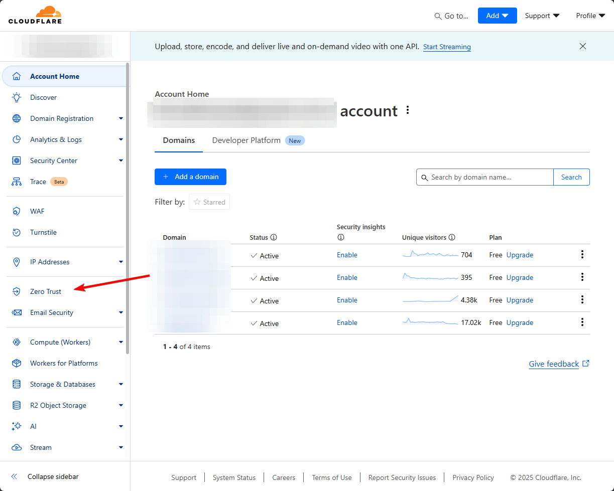

After that, in the [zero trust dashboard](https://one.dash.cloudflare.com/), you'll need to set up an Application and Access Policy, and a tunnel to your local server. So go to **Access --> Applications** and hit the `Add an application` button. On the following page, choose **Self-hosted**, and name it whatever you want. Then add a public hostname for your application; it is the same as the `WEBHOOK_URL` of your n8n.
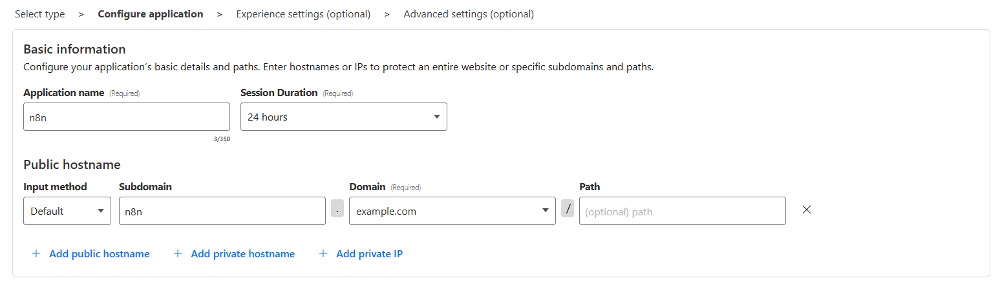

### Access Policies

In the **Access policies** section, choose `Create new policy`. If, like me, you also plan to use the webhook for Telegram only, you can create a specific policy for that to allow only Telegram servers to access your webhook endpoint. To do so, do the following:

* Policy name: telegram (or whatever)
* **Action**: `Service Auth`
* **Session duration**: `1 month`
* Add rules: `Include`
  * **Selector**: `IP ranges`
  * **Value**: \`91.108.56.0/22 , 91.108.4.0/22 , 91.108.8.0/22 , 91.108.16.0/22 , 91.108.12.0/22 , 149.154.160.0/20 , 91.105.192.0/23 , 91.108.20.0/22 , 185.76.151.0/24 , 2001:b28:f23d::/48 , 2001:b28:f23f::/48 , 2001:67c:4e8::/48 , 2001:b28:f23c::/48 , 2a0a:f280::/32

> [!info] 
> You can find the latest Telegram IP range from here: https://core.telegram.org/resources/cidr.txt

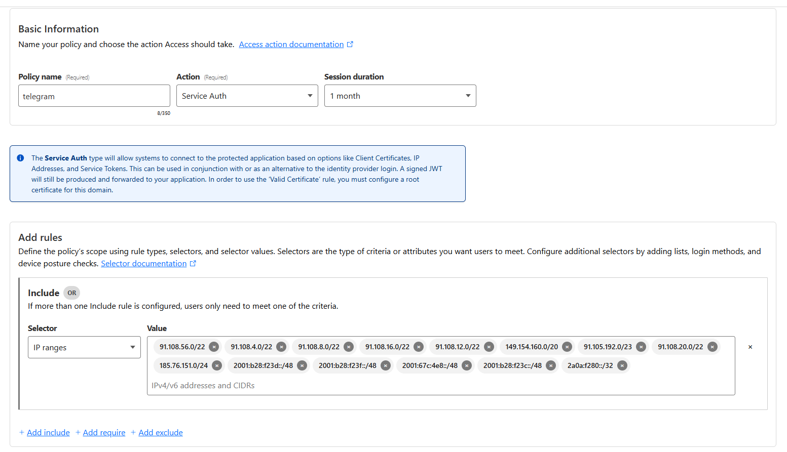
And save. If you also want to enable yourself to access the n8n instance on your local server via the same domain, you can add another policy to do so:

* Policy name: admin-only (or whatever)
* **Action**: `Allow`
* **Session duration**: `same as application` (or whatever you prefer)
* Add rules: `Include`
  * **Selector**: `Emails`
  * **Value**: `YOUR FULL EMAIL ADDRESS`, like: `example@gmail.com`

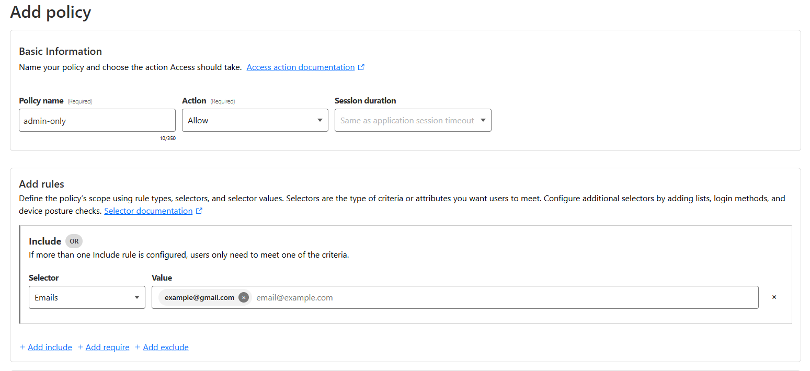
Then in the `Access policies` section of your Application, choose the new policies you just created:
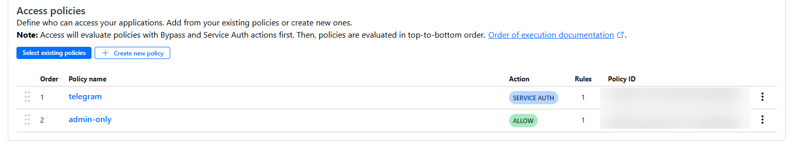
And continue the setup with the default values until the application is created:
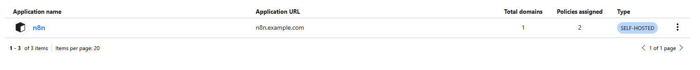

### Tunnel

Now, it's time to set up our tunnel from CF to the local server. Go to the **Networks --> Tunnels** section, and hit the `Create a tunnel` button. Select the **Cloudflared** type, and set a name for the tunnel.
In the "install connectors" step, choose the OS that you have, and follow the instruction and run the command Cloudflare gave you on your local server:
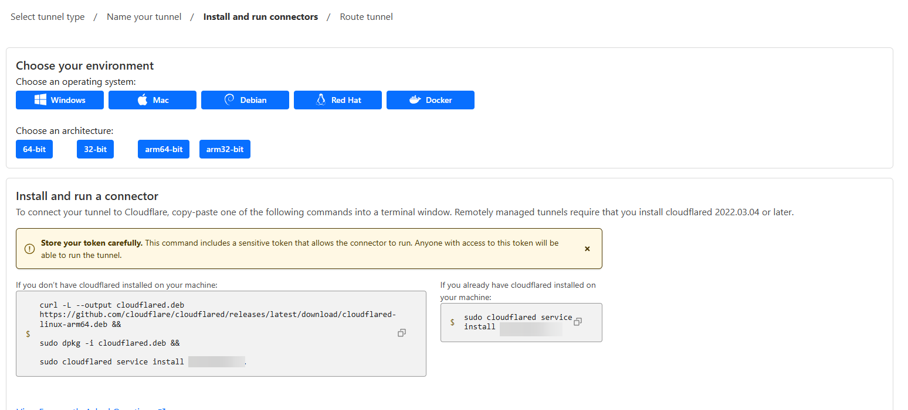

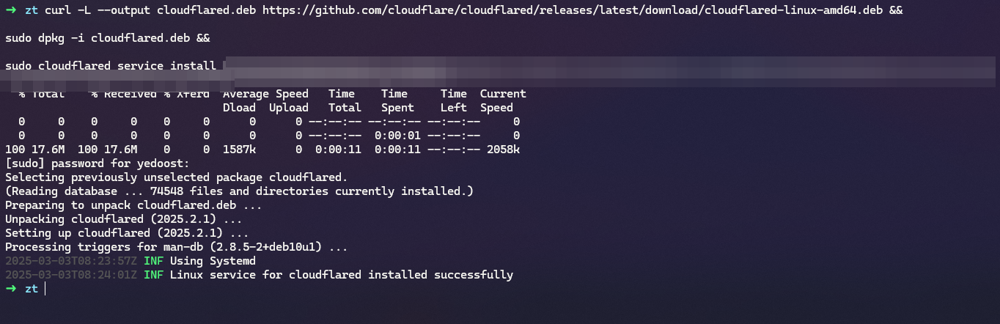
And wait for the connector to show up in the **Connectors** section below:
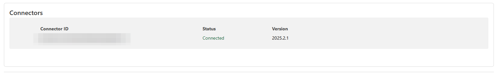

In the next section, let's add the webhook domain as a public hostname for our n8n setup. In the type and URL section, we should enter the one that we are using to access our n8n setup locally:

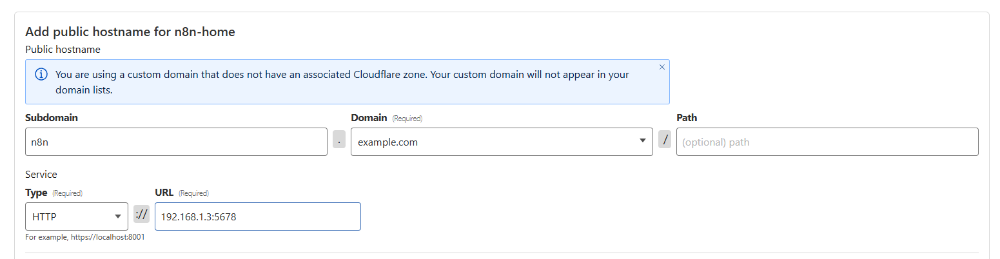

Then in the **Additional Application Settings --> Access**, enable and select the application we just created in the previous step:
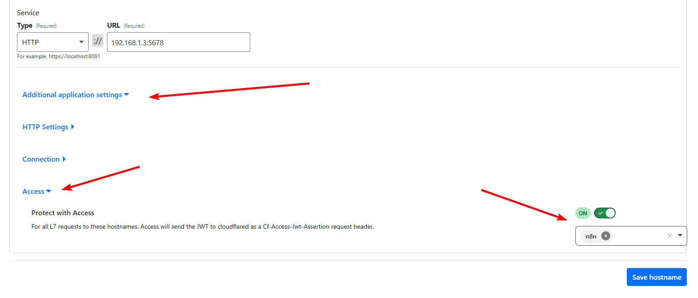

And then, we're done here. Let's check our webhook URL. If you added the `admin-only` policy, you should see the screen below when you enter the URL in your browser. If you only set up the `telegram` policy, you should get a 403 error while opening the URL, and that's fine.

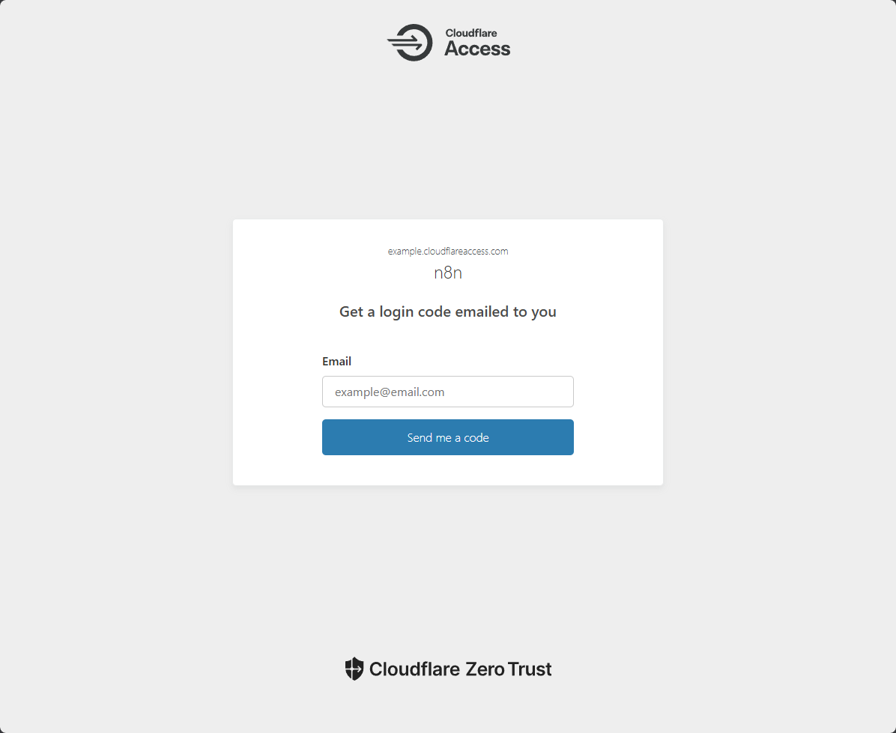

And if you enter the email address you configured in the policy, you should get an OTP code, and if you enter it successfully, you should see your local n8n page. But now, you are accessing it using CFZT across the internet 🎉

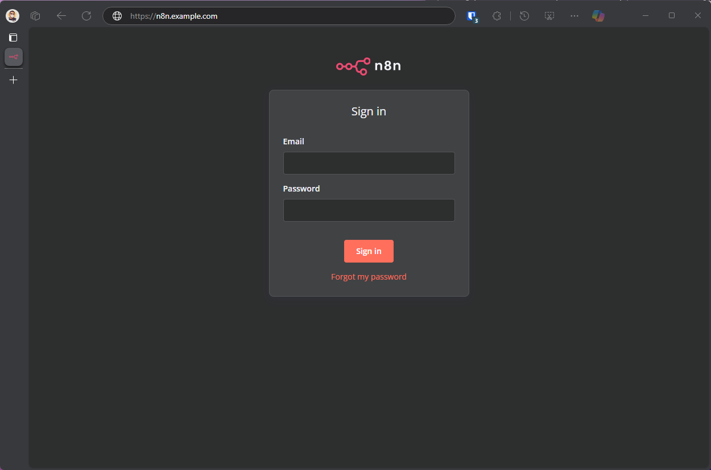

### Grammarly Telegram Bot

Now, let's create a simple Telegram bot together, and test to see if our Telegram webhook is working properly. In the n8n dashboard, hit "start from scratch", and do the following:

1. Add a **Telegram On Message** trigger.
   1. Create a new bot with https://t.me/BotFather.
   1. In the Telegram Trigger Node setup, credential section, create a new credential and paste the token of your bot that you got from BotFather there.

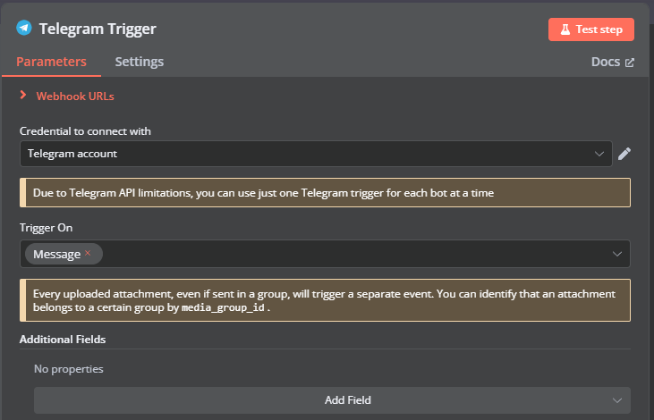

1. Add an **AI Agent** Node
   1. Agent: `Conversational Agent`
   1. Source for Prompt: `Define below`
   1. Text: `{{ $json.message.text }}`
   1. In the options section, let's add a **System Message**, add the prompt you want. I use the one from here: https://github.com/f/awesome-chatgpt-prompts?tab=readme-ov-file#act-as-an-english-translator-and-improver

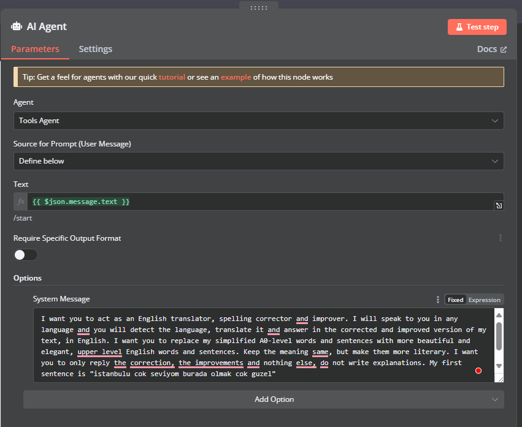

3. Connect A **Chat Model**
   1. I use Gemini for this post, since it's free.
   1. You can get a free API key from here: https://makersuite.google.com/app/apikey

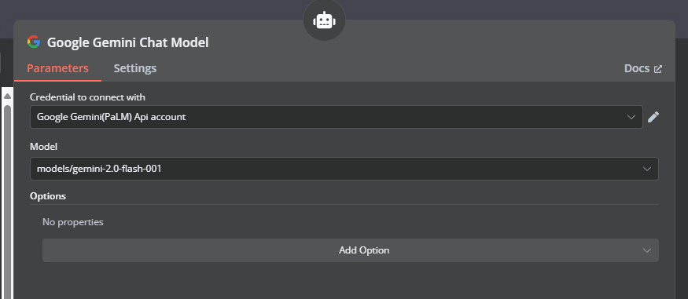

4. Add a **Telegram Send Text Message** Node to finish things up
   1. Chat ID: `{{ $('Telegram Trigger').item.json.message.chat.id }}`
   1. Text: `{{ $json.output }}`

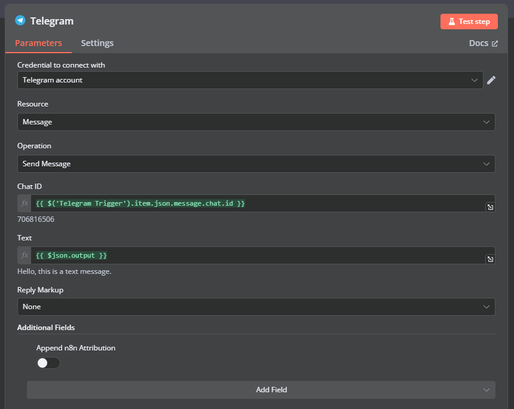

And now we are finished. Let's test our workflow with the `Test workflow` button, and then send a message in the bot.

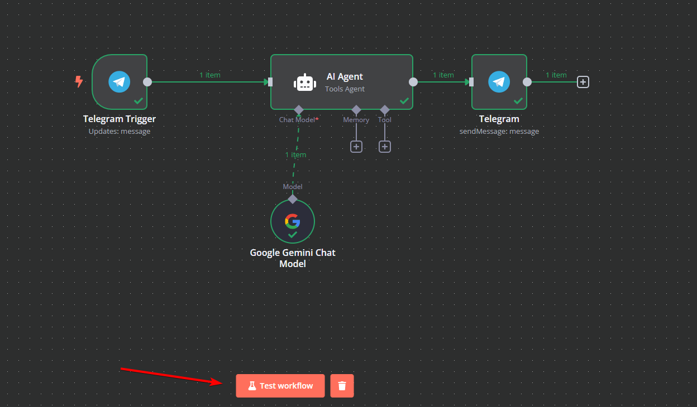
And we should see the bot corrected our message:
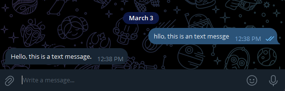

Now let's save and activate our workflow. Congrats, you just created your first AI Agent bot, free, and running on your local home server.
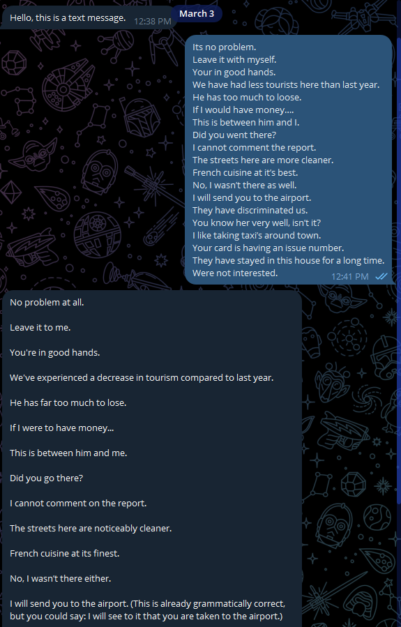

## Final Thoughts

I've been using this setup for a week now, and I'm really happy with how it turned out. Using Cloudflare Zero Trust solves so many problems at once:

* My home server stays protected behind CFZT, with no direct exposure to the internet
* I don't need to worry about my dynamic IP address changing and breaking my webhooks
* I can access my n8n dashboard securely from anywhere
* The whole thing costs me nothing extra since I'm using the free tier of Cloudflare Zero Trust, or paying any extra for static IP

In a future post, I'll probably show how to connect to your entire local network via Warp using the same tunnel we just created here. This is super useful because it means you can securely access not just n8n but literally any service on your home network (RDP, SMB, jellyfin, etc...) from anywhere in the world. It's simpily a VPN back to your home, but without any headache of securing it.

If you've set this up or have questions about any part of the process, let me know in the comments! I'm still exploring all the possibilities of what can be done with this setup.
